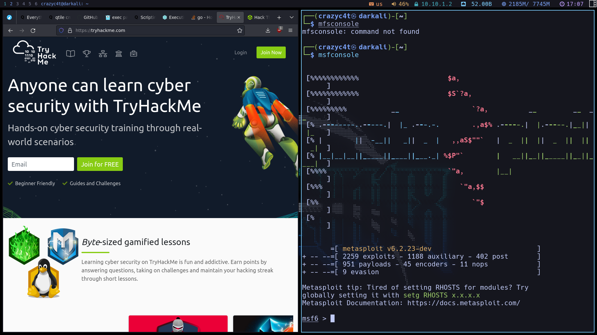

# DarKali


> This is my setup for my Kali Linux installation in a virtual machine, made ready for pentesting with speed, no bloat and maximum use of resources.

DarKali is made for setting up a minimalist Kali Linux installation (without desktop environment) into the perfect setup within minutes, running just one script!

## Why?

I was using the default xfce desktop that kali comes with (it's awesome!) but I felt slow, I needed my mouse a lot for doing basic things and it was bloated for my usage, I just need a browser, a terminal, neovim and the hacking tools pre-built and I'm ready to go, so that's why DarKali exists, it's a script that installs [my personal configs](https://github.com/crazyc4t/dotfiles) specially made for my usage of kali and the [Qtile](http://www.qtile.org/) window manager, that is light-weight and completely hackable to the core being written in [Python](https://www.python.org/) so it's easy to start hacking on it, everything simple and blazingly fast!



## Getting started

Clone this repository:

```bash
git clone https://github.com/crazyc4t/darkali.git
```

Then move into the "darkali" directory and you are good to go!

```bash
./darkali --help
```

## The Darkali CLI

I made a command-line interface program for ease of housekeeping, being updating and cleaning the system, as well as installing it of course, written in [Go](https://go.dev/) with the [Cobra](https://pkg.go.dev/github.com/spf13/cobra) package and the [Cute](https://pkg.go.dev/github.com/zakaria-chahboun/cute) for printing, with the help of some bash scripts.

If you want to have the tool system-wide, you can install it with `go install` inside the "darkali" directory! (Go needs to be installed)

Usage:

```bash
darkali --help
```

```bash
darkali install
```

```bash
darkali update
```

```bash
darkali clean
```

```bash
darkali setIp 10.10.10.1
```

## Keybindings

My window manager config is **heavily** based on VIM keybindings, you can change/add/remove the keybindings as you want, in `~/.config/qtile/settings/keymaps.py`

Basic keybindings:

| Key             | Action                       |
| --------------- | ---------------------------- |
| Mod + h         | Left focus                   |
| Mod + j         | Down focus                   |
| Mod + k         | Up focus                     |
| Mod + l         | Right focus                  |
| Mod + Shift + h | Change window position left  |
| Mod + Shift + j | Change window position down  |
| Mod + Shift + k | Change window position up    |
| Mod + Shift + l | Change window position right |
| Mod + Shift + f | Change layout to floating    |
| Mod + w         | Kill window                  |
| Mod + Return    | Terminal                     |
| Mod + Print     | Screenshot                   |
| Mod + b         | Browser                      |
| Mod + z         | Spanish keyboard layout      |
| Mod + x         | English keyboard layout      |
| Mod + e         | Thunar file manager          |

## FAQ

- Neovim is crashing everywhere and looks horrible?!?!

  - Press Shift+P to install the plugins, do it a couple of times since are a bit of plugins.

- "No window managers, no session managers, no terminal emulators found, aborting..."

  - This is because it's starting the default Xsession which is nothing really, so you need to chose Qtile from the Session option:

  - 

- Images opening in a weird program from thunar?
  - Change the properties of the file to open those files with "ristretto" by default.

## Thanks!


Made by crazyc4t with <3
[My website!](https://crazyc4t.xyz)
